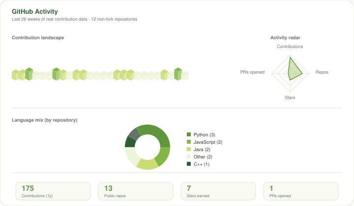
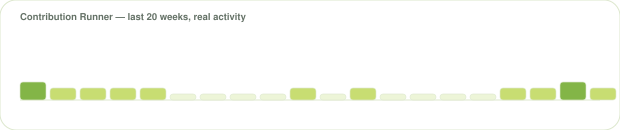

  

  

## About Me

Building small, focused tools — a Java desktop app for managing color palettes, a couple of Power BI and Excel dashboards, and a Python machine-learning model for predicting student outcomes.
Comfortable moving between GUI development, data analysis, and applied ML.
Currently exploring full-stack app development and generative AI.

  

## Tech Stack

<table>
<tr><td valign="top" width="140"><b>Languages</b></td><td>

</td></tr>
<tr><td valign="top"><b>Web &amp; Full-Stack</b></td><td>

</td></tr>
<tr><td valign="top"><b>Data &amp; Analytics</b></td><td>

  

</td></tr>
<tr><td valign="top"><b>Machine Learning</b></td><td>

 

</td></tr>
<tr><td valign="top"><b>Databases</b></td><td>

</td></tr>
</table>

  

## Featured Projects

<table>
<tr>
<td width="50%" valign="top">

**[HueHaven](https://github.com/Neha501/HueHaven)**
Java Swing/AWT color-palette manager backed by MySQL, built around Stack/ArrayList/Queue data structures.
`Java` · `Swing` · `MySQL`

</td>
<td width="50%" valign="top">

**[Student Academic Performance Prediction](https://github.com/Neha501/Student-Academic-Performance-Prediction)**
ML model identifying at-risk students from 1,000+ records using Scikit-learn.
`Python` · `Pandas` · `scikit-learn`

</td>
</tr>
<tr>
<td width="50%" valign="top">

**[E-Commerce Customer Behavior Analysis](https://github.com/Neha501/E-Commerce-Customer-Behavior-Purchase-Analysis)**
Power BI dashboard covering engagement, conversion, delivery experience, and repeat-purchase behavior across 1,145 users.
`Power BI` · `DAX`

</td>
<td width="50%" valign="top">

**[Retail Sales Analytics Dashboard](https://github.com/Neha501/Retail-Sales-Analytics-Dashboard)**
Excel/Power Query BI dashboard on retail transaction data — category, regional, and time-based sales analysis.
`Excel` · `Power Query`

</td>
</tr>
</table>

> **Note:** `AI_Study_Assistance` (a full-stack app with a live deployed demo) was considered for this section but held back — its README references another GitHub user's clone URL, so authorship couldn't be confidently verified from public data alone. See `docs/IMPLEMENTATION_NOTES.md` for details; it can be added here once confirmed.

  

## GitHub Activity

  

Regenerated daily from live GitHub data — see <code>scripts/generate_analytics.py</code>.

  

## Contribution Runner

  

  

## Coding Profiles

<!-- LeetCode activity is confirmed (see docs/IMPLEMENTATION_NOTES.md), but no public LeetCode profile URL exists on this account yet. Add it below once available: -->
<!--  -->

*LeetCode problem-solving activity is confirmed through this account's LeetHub-synced repository. A public LeetCode profile link will be added here once provided — see `docs/IMPLEMENTATION_NOTES.md` for what's needed.*

  

## Connect With Me

<!-- LinkedIn and email are intentionally omitted here — see docs/IMPLEMENTATION_NOTES.md. Add once confirmed: -->
<!--  -->
<!--  -->

  

  

