  

 

 

  &nbsp;&nbsp;&nbsp;&nbsp;
  &nbsp;&nbsp;&nbsp;&nbsp;
  &nbsp;&nbsp;&nbsp;&nbsp;
  

---

  <i>"Building at the intersection of Data Analytics, Full-Stack Development, and AI — transforming ideas into clean, scalable, and impactful solutions."</i>

---

 

## 👤 About Me

I am a results-driven **Data Analyst**, **Full Stack Developer**, and **Machine Learning Enthusiast** with a strong foundation as a **Java Developer** and a passion for solving complex technical problems. I bridge the gap between backend engineering, interactive GUI tool building, and data-driven insights, always striving to design clean, optimized, and scalable applications.

- 🎯 **Current Focus:** Deepening expertise in full-stack web development, algorithmic data structures (Java), and machine learning pipelines.
- 🌱 **Learning:** Advanced Generative AI, cloud deployment, and system design patterns.
- 💬 **Ask me about:** Java, Python, C++, MySQL, Pandas, Power BI, Excel, Swing GUI.
- ⚡ **Fun Fact:** I believe every complex problem has a clean, simple, and elegant solution hiding within it.

 

## 🛠️ Tech Stack & Skills

### Languages

### Frameworks & Libraries

### Databases & Cloud

### DevOps & Tools

 

  

## 🚀 Featured Projects

| 🤖 AI Study Platform | 🎨 HueHaven |
| :--- | :--- |
| **Full Stack AI App** An AI-powered study platform featuring smart notes, flashcards, quizzes, and personalized learning dashboards. *An intelligent learning ecosystem powered by modern AI workflows.* | **Java GUI Application** A color palette management application implementing Stack, Queue, and ArrayList with MySQL backend storage. *A desktop application combining clean UI with strong data structures.* |
| [View Repository](https://github.com/Neha501/AI_Study_Assistance) | [View Repository](https://github.com/Neha501/HueHaven) |

| 📊 Zomato Analytics | 🎓 Student ML Model |
| :--- | :--- |
| **Data Analytics** Interactive Power BI and Excel dashboards analyzing restaurant ratings, cuisines, and pricing insights. *Transforming raw restaurant transaction data into meaningful insights.* | **Machine Learning** A classification model predicting academic outcomes using Python, Scikit-learn, and Pandas preprocessing. *Applying machine learning to identify student academic success factors.* |
| [View Repository](https://github.com/Neha501/Zomato-Analytics-Dashboard) | [View Repository](https://github.com/Neha501/Student-Academic-Performance-Prediction) |

  

## 📊 GitHub Statistics

<table border="0" width="100%">
  <tr>
    <td width="50%" align="center" valign="top">
      
    </td>
    <td width="50%" align="center" valign="top">
      
    </td>
  </tr>
</table>

  

## 🐍 Contribution Snake

  

  

## 🤝 Connect With Me

&nbsp;

&nbsp;

  

---

> *"Code is like humor. When you have to explain it, it’s bad."* — Cory House

 

  

<a href="#top">Back to Top ⬆️</a>

